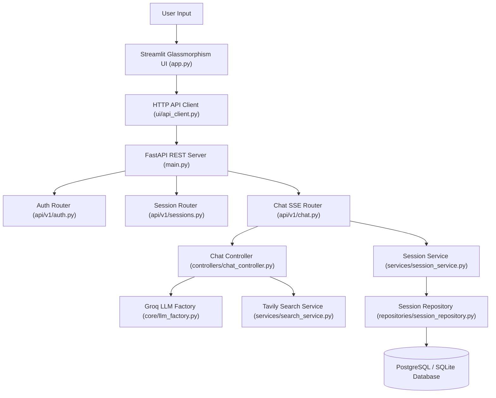

# 🚀 AI Chat Assistant (FastAPI + Streamlit)

An enterprise-grade **AI Chat Application** built with **FastAPI REST Backend**, **Groq LLM (`llama-3.3-70b-versatile`)**, **SQLAlchemy Async ORM (PostgreSQL & SQLite)**, **Tavily Real-Time Web Search**, and a **Streamlit Glassmorphism UI Client**.

---

## 🌟 Key Features

- **Open Conversational AI**: Ask any question immediately from message #1—coding, live web search, weather, local facts, creative writing, or general Q&A.

- **Real-Time Token Streaming**: Real-time typewriter token streaming on the UI using Server-Sent Events (SSE) and `st.write_stream(...)`.
- **FastAPI REST Backend API**: Decoupled backend server handling JWT Authentication (`/api/v1/auth`), Sessions (`/api/v1/sessions`), and Streaming Chat (`/api/v1/chat`).
- **Autonomous Agentic Web Search**: On-demand Tavily web search integration fetching live facts, news updates, and real-time information.
- **Autonomous Context Reasoning**: Detects missing parameters (such as missing location for local weather) and asks friendly clarification questions before acting.
- **Enterprise Repository Pattern & Database Pooling**: Async SQLAlchemy ORM using `AsyncAdaptedQueuePool` (PostgreSQL) and `NullPool` (SQLite).
- **Clean Architecture & SOLID Principles**: Decoupled packages for `prompts/`, `tools/`, `controllers/`, `services/`, `repositories/`, `api/`, and `ui/`.

---

## 🏗️ System Architecture



---

## 📁 Project Directory Structure

```text
conversation_agent/
├── app.py                      # Streamlit UI composition root
├── main.py                     # FastAPI application entrypoint
├── pyproject.toml              # UV dependency definition & Ruff linter settings
├── .env.example                # Public environment configuration template
├── api/                        # FastAPI REST Route Handlers
│   ├── deps.py                 # Dependency injection & JWT guard
│   └── v1/                     # Versioned API routes (auth, sessions, chat)
├── config/                     # Centralized settings & constants
│   ├── settings.py             # Environment settings loader
│   └── constants.py            # App titles & node constants
├── core/                       # Core Infrastructure
│   ├── database.py             # SQLAlchemy Async Engine & Session Manager
│   └── llm_factory.py          # Groq Chat model instance
├── controllers/                # Chat Orchestration Controllers
│   └── chat_controller.py      # Prompt evaluation, search, & reply flow
├── models/                     # Database ORM Entities
│   ├── user.py                 # UserModel ORM entity
│   └── session.py              # SessionModel ORM entity
├── prompts/                    # Dedicated System & Evaluation Prompts
│   ├── system_prompts.py       # Assistant system prompts
│   └── eval_prompts.py         # Search evaluation & synthesis prompts
├── repositories/               # Repository Data Access Layer (SOLID)
│   ├── base_repository.py      # Abstract repository contract
│   ├── user_repository.py      # User CRUD operations
│   └── session_repository.py   # Owner-scoped session CRUD operations
├── schemas/                    # Pydantic Request/Response Models
│   ├── auth.py                 # Auth schemas
│   ├── session.py              # Session schemas
│   └── schemas.py              # Chat decision & message schemas
├── services/                   # Core Business Logic Services
│   ├── auth_service.py         # JWT generation & password hashing
│   ├── session_service.py      # Session domain operations
│   ├── search_service.py       # Tavily Web Search API client
│   └── profile_service.py      # Profile persistence service
├── tools/                      # Dedicated Agent Tooling
│   ├── tavily_search.py        # Tavily search tools
│   └── profile_tools.py       # Profile persistence tools
├── ui/                         # Streamlit UI & Client Adapters
│   ├── api_client.py           # Production HTTP Client with connection pooling
│   ├── auth_ui.py              # Authentication UI forms
│   ├── components.py           # Custom Glassmorphism UI components
│   └── session.py              # Session state manager
└── utils/                      # Helper Utilities
    ├── logger.py               # Centralized logger
    └── sanitizer.py            # Response regex sanitizer
```

---

## 🚀 Running the Application

### 1. Launch FastAPI Backend Server (Terminal 1)
```bash
uv run uvicorn main:app --reload --port 8000
```
👉 Backend API running at **[http://localhost:8000](http://localhost:8000)**  
👉 Interactive Swagger Docs at **[http://localhost:8000/docs](http://localhost:8000/docs)**

### 2. Launch Streamlit Web UI Client (Terminal 2)
```bash
uv run streamlit run app.py
```
👉 Web UI running at **[http://localhost:8501](http://localhost:8501)**

---

## ⚙️ Environment Configuration

Copy `.env.example` to `.env`:
```bash
cp .env.example .env
```

Configure `.env` keys:
```env
GROQ_API_KEY=gsk_your_groq_api_key_here
GROQ_MODEL=llama-3.3-70b-versatile
TAVILY_API_KEY=tvly-your_tavily_api_key_here
DATABASE_URL=sqlite:///data/conversations.db
JWT_SECRET_KEY=super-secret-production-jwt-key-2026-secure
```

---

## 🧪 Code Quality & Auditing

Run Ruff linter and code formatter:
```bash
uv run ruff check . --fix
uv run ruff format .
```
