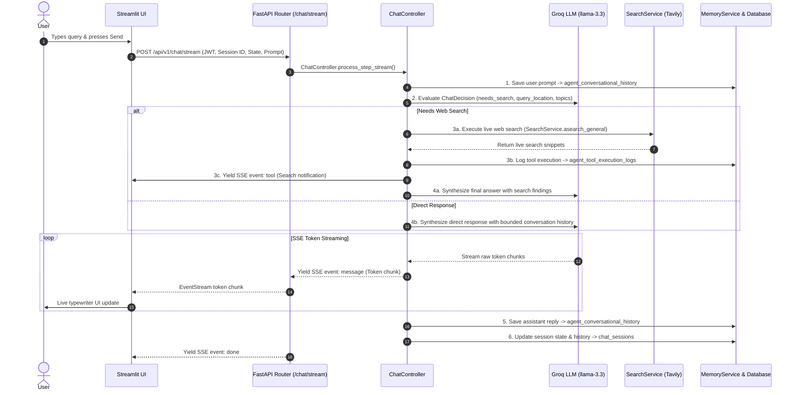

# 🚀 Conversation Agent — Enterprise AI Assistant

An enterprise-grade, stateful **AI Chat Assistant** built with a decoupled **FastAPI REST & Streaming Backend**, **Groq LLM (`llama-3.3-70b-versatile`)**, **SQLAlchemy Async ORM (PostgreSQL & SQLite)**, **Tavily Real-Time Web Search**, **HuggingFace Vector Embeddings**, and a **Streamlit Glassmorphism UI Client**.

---

## 🌟 Key Features

- **Decoupled System Architecture** — Clean separation of concerns between backend REST API (`FastAPI`) and glassmorphic frontend client (`Streamlit`).
- **Real-Time Token Streaming** — High-performance Server-Sent Events (SSE) streaming with live typewriter token rendering in the UI.
- **Structured Prompt Evaluation** — Evaluates user queries using Groq structured output (`ChatDecision`) to determine search intent, user profile attributes, and clarification requirements.
- **Autonomous Live Web Search** — Real-time web retrieval via Tavily API for news, current events, weather, facts, and post-cutoff knowledge.
- **Resilient Memory Engine** — Relational database tracking for chat history, user profiles, session states, and tool execution logs.
- **Vector Memory Store** — Semantic vector storage (via HuggingFace MiniLM / open-source fallback embeddings) supporting knowledge base retrieval, context window summarization, and entity extraction.
- **Security & Connection Hardening** — JWT authentication, SQLAlchemy connection pooling (`pool_pre_ping`, `pool_recycle`), CORS controls, and HTML output sanitization.

---

## 🏗️ System Architecture

```
                               ┌───────────────────────────┐
                               │   Streamlit UI Client     │
                               │  (Glassmorphism Frontend) │
                               └─────────────┬─────────────┘
                                             │ HTTP / SSE Stream
                                             ▼
                               ┌───────────────────────────┐
                               │   FastAPI REST Backend    │
                               │   (/api/v1/chat/stream)   │
                               └─────────────┬─────────────┘
                                             │
                       ┌─────────────────────┴─────────────────────┐
                       ▼                                           ▼
         ┌───────────────────────────┐               ┌───────────────────────────┐
         │      ChatController       │               │      MemoryService        │
         │  (Orchestration & Stream) │               │   (Relational & Vector)   │
         └─────────────┬─────────────┘               └─────────────┬─────────────┘
                       │                                           │
         ┌─────────────┼─────────────┐               ┌─────────────┼─────────────┐
         ▼             ▼             ▼               ▼             ▼             ▼
   ┌──────────┐  ┌──────────┐  ┌──────────┐    ┌──────────┐  ┌──────────┐  ┌──────────┐
   │   Groq   │  │  Tavily  │  │ Langfuse │    │  SQLite /│  │ Hugging  │  │ Context  │
   │   LLM    │  │  Search  │  │ Observ.  │    │ Postgres │  │   Face   │  │ Summaries│
   └──────────┘  └──────────┘  └──────────┘    └──────────┘  └──────────┘  └──────────┘
```

---

## 🔄 End-to-End Request Flow

The sequence diagram below illustrates what happens when a user sends a chat message:



---

## 💾 Memory & Database Schema Architecture

The system utilizes both **relational database tables** and **vector store models**:

### Relational Tables

| Table Name | Description | When Written |
| :--- | :--- | :--- |
| **`users`** | Registered user credentials & account metadata. | Created on `POST /api/v1/auth/register`. |
| **`chat_sessions`** | Persistent session state, UI message history, and LangChain message history. | Created on session init; updated on every turn via `SessionService.save_session`. |
| **`agent_conversational_history`** | Raw message history logged per thread/session. | Saved on every message turn (both `user` prompt and `assistant` response). |
| **`agent_tool_execution_logs`** | Detailed logs of tool calls (tool name, query args, results preview, error state). | Saved immediately whenever `Tavily` search executes. |

### Vector Memory Models

| Model / Table | Purpose |
| :--- | :--- |
| **`agent_context_summaries`** | Stores dense summaries of older conversation history when context limit threshold is reached. |
| **`agent_entities_registry`** | Stores extracted named entities (`PERSON`, `PLACE`, `SYSTEM`) and descriptions for context retrieval. |
| **`agent_knowledge_base_vectors`** | Stores vector embeddings of knowledge base documents for semantic RAG search. |
| **`agent_workflow_patterns`** | Stores multi-step problem-solving patterns and workflow executions. |

---

## 📁 Directory Structure

```
conversation_agent/
├── backend/                    # FastAPI REST & Streaming Backend
│   ├── main.py                 # Application entrypoint & middleware setup
│   ├── api/                    # REST routes & JWT auth dependencies
│   │   ├── deps.py             # Auth & DB dependency injection
│   │   └── v1/                 # API v1 handlers (auth, sessions, chat)
│   ├── config/                 # Environment settings & application constants
│   ├── controllers/            # Core ChatController (stream, evaluate, synthesize)
│   ├── core/                   # Database engine, session maker, LLM factory
│   ├── models/                 # SQLAlchemy ORM models (users, sessions, memory)
│   ├── prompts/                # System & evaluation prompt templates
│   ├── repositories/           # Data access layer (user, session, memory repos)
│   ├── schemas/                # Pydantic validation schemas (StateUpdate, ChatDecision)
│   ├── services/               # Business logic (search, memory, session, embeddings)
│   └── utils/                  # Logger & text sanitizer utilities
│
├── frontend/                   # Streamlit Glassmorphism UI Client
│   ├── app.py                  # Streamlit application entrypoint
│   └── ui/                     # Modular UI components
│       ├── api_client.py       # Async HTTP client with connection pooling & SSE parsing
│       ├── auth_ui.py          # Authentication forms (Login / Signup)
│       ├── components.py       # Glassmorphism CSS styles & header components
│       └── session.py          # Streamlit session state manager
│
├── pyproject.toml              # Project dependencies & tool configs
├── .env.example                # Template environment file
└── README.md                   # System documentation
```

---

## 🚀 Getting Started

### Prerequisites

- **Python 3.13+**
- **[uv](https://docs.astral.sh/uv/)** package manager

### 1. Installation

```bash
git clone https://github.com/gokul-steveai/conversation_agent.git
cd conversation_agent
uv sync
```

### 2. Environment Configuration

Copy `.env.example` to `.env` and fill in your API keys:

```bash
cp .env.example .env
```

Key environment variables:

```env
GROQ_API_KEY=gsk_your_groq_api_key
GROQ_MODEL=llama-3.3-70b-versatile
TAVILY_API_KEY=tvly-your_tavily_api_key
DATABASE_URL=sqlite:///data/conversations.db
JWT_SECRET_KEY=your-jwt-secret-key
BASE_API_URL=http://localhost:8000/api/v1
```

---

## 💻 Running the Application

### Option A: Run Backend & Frontend Separately

**Terminal 1 — Backend (FastAPI):**
```bash
cd backend
uv run uvicorn main:app --reload --port 8000
```

**Terminal 2 — Frontend (Streamlit):**
```bash
uv run streamlit run frontend/app.py
```

### Service URLs

| Component | URL |
| :--- | :--- |
| **Streamlit UI** | [http://localhost:8501](http://localhost:8501) |
| **FastAPI Backend** | [http://localhost:8000](http://localhost:8000) |
| **Swagger API Docs** | [http://localhost:8000/docs](http://localhost:8000/docs) |

---

## 📡 API Endpoints Reference

### Authentication (`/api/v1/auth`)
- `POST /api/v1/auth/register` — Register a new account
- `POST /api/v1/auth/login` — Login and receive JWT access token
- `GET /api/v1/auth/me` — Retrieve current authenticated user profile

### Sessions (`/api/v1/sessions`)
- `GET /api/v1/sessions` — List user conversation sessions
- `POST /api/v1/sessions` — Create a new chat session
- `GET /api/v1/sessions/{session_id}` — Get session details and history
- `DELETE /api/v1/sessions/{session_id}` — Delete a conversation session

### Chat & Streaming (`/api/v1/chat`)
- `POST /api/v1/chat/message` — Synchronous chat endpoint
- `POST /api/v1/chat/stream` — Real-time Server-Sent Events (SSE) streaming endpoint

---

## 🧪 Code Quality & Verification

Run linter and formatter:

```bash
uv run ruff check --fix .
uv run ruff format .
```
