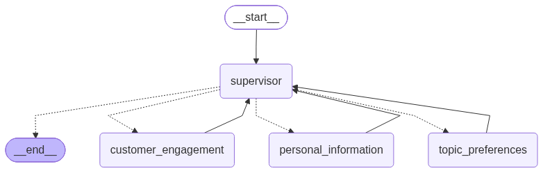
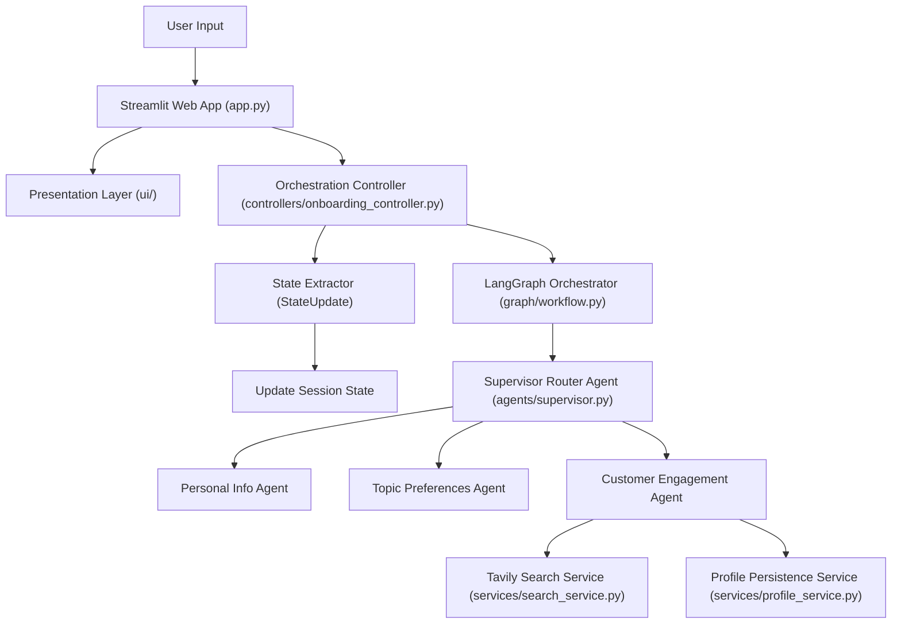

# 🚀 Autonomous Multi-Agent Onboarding Assistant

An enterprise-grade, interactive multi-agent onboarding system built with **LangGraph**, **Groq LLM (`llama-3.3-70b-versatile`)**, **Tavily Web Search**, and a **Streamlit Glassmorphism Web App**.

---

## 🌟 Key Features

- **Supervisor Router Orchestration**: LangGraph state graph with dynamic supervisor routing between specialized agents.
- **Real-Time Tavily Web Search**: Live search integration for personalized local facts and news updates based on extracted user profile.
- **Response Sanitization Engine**: Automatic regex sanitizer preventing LLM schema variable leaks in chat output.
- **Streamlit Glassmorphism UI**: Custom system theme UI with quick suggestion pills, real-time onboarding progress tracking, and session management.
- **Strict Behavioral Architecture**: Modular decoupling across Presentation (`ui/`), Orchestration (`controllers/`), Agents (`agents/`), Services (`services/`), Data Schemas (`models/`), and Configuration (`config/`).

---

## 🏗️ System Architecture



### Workflow Flowchart Diagram



---

## 📁 Project Structure

```text
conversation_agent/
├── app.py                      # Streamlit UI composition entrypoint
├── main.py                     # CLI terminal entrypoint
├── pyproject.toml              # Project dependencies & Ruff config
├── .env                        # Environment variable secrets
├── config/                     # Centralized settings & prompt constants
│   ├── settings.py
│   └── constants.py
├── controllers/                # Interaction orchestration behavior
│   └── onboarding_controller.py
├── core/                       # LLM Provider Factory (ChatGroq)
│   └── llm_factory.py
├── models/                     # StateGraph & Pydantic structured output models
│   ├── schemas.py
│   ├── state.py
│   └── onboarding.py
├── services/                   # Business logic services (Tavily Search & Profile DB)
│   ├── search_service.py
│   └── profile_service.py
├── agents/                     # Specialized LangGraph Agent nodes
│   ├── supervisor.py
│   ├── personal_information.py
│   ├── topic_preferences.py
│   └── customer_engagement.py
├── graph/                      # LangGraph workflow definition & router
│   ├── workflow.py
│   └── router.py
├── tools/                      # Tool wrappers for agent function calling
│   └── tavily_search.py
├── ui/                         # Streamlit presentation components & session state
│   ├── components.py
│   └── session.py
└── utils/                      # Console UI, logging & response sanitizer
    ├── logger.py
    ├── console.py
    └── sanitizer.py
```

---

## ⚙️ Environment & Setup

### 1. Requirements & Prerequisites
- Python `3.13+`
- [`uv`](https://github.com/astral-sh/uv) (Recommended fast package manager)

### 2. Environment Variables
Create a `.env` file in the project root:

```env
GROQ_API_KEY=gsk_your_groq_api_key_here
GROQ_MODEL=llama-3.3-70b-versatile
TAVILY_API_KEY=tvly-your_tavily_api_key_here

LANGSMITH_TRACING=true
LANGSMITH_API_KEY=lsv2_pt_your_langsmith_api_key_here
LANGSMITH_PROJECT="Deep Agents"
```

---

## 🚀 Running the Application

### Launch Streamlit Web UI
```bash
uv run streamlit run app.py
```
👉 Open browser at **[http://localhost:8501](http://localhost:8501)**

### Launch CLI Terminal Interface
```bash
uv run main.py
```

### Code Quality & Formatting (Ruff)
```bash
uv run ruff check . --fix
uv run ruff format .
```
